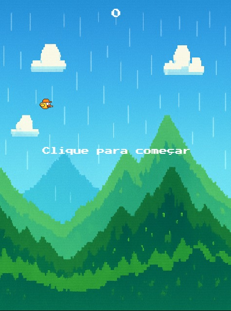
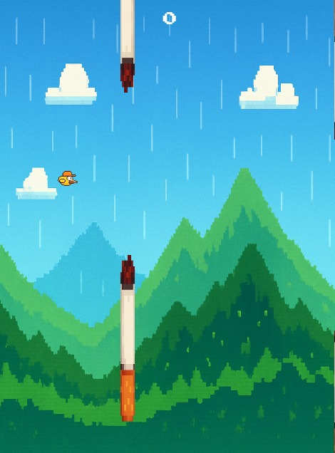
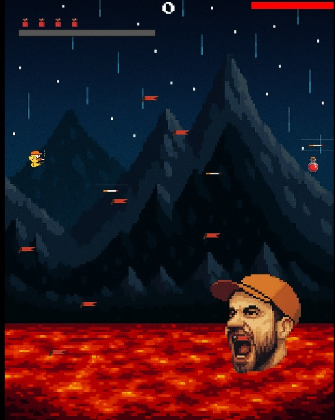
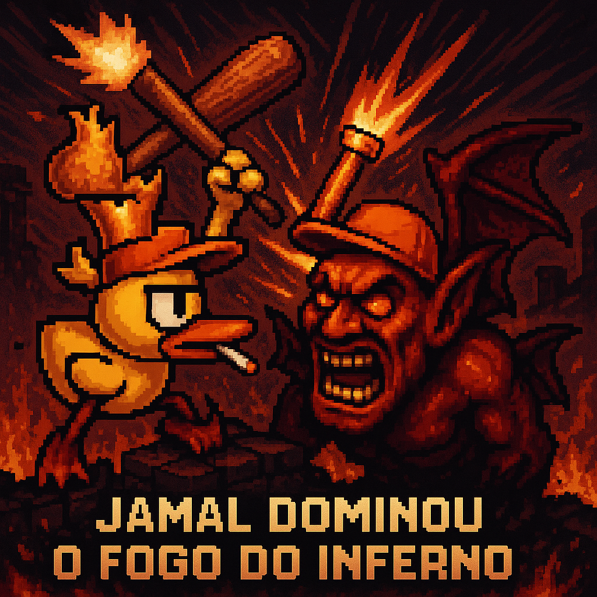

. 🐤 Jamal Contra os Legendários . 

Um jogo em JavaScript estilo Flappy Bird, com um toque especial: Jamal deve atravessar obstáculos, sobreviver aos perigos e enfrentar um boss final lendário.

  

🎮 Como jogar
Clique com o mouse ou aperte a barra de espaço para fazer o Jamal voar!

Evite os tubos de cigarro durante a primeira fase.

Sobreviva até enfrentar o boss lendário.

Desvie das bandeiras do boss e dispare cigarros reversos de volta para derrotá-lo!

📸 Tutorial com imagens
🟢 Fase 1 – Desvie dos tubos

  

O Jamal precisa passar por 10 tubos sem encostar.

Cada tubo equivale a 1 ponto.

A gravidade é implacável!

🔥 Fase 2 – Batalha contra o Boss

  

O boss se move verticalmente e lança bandeiras contra você.

Se você for atingido, perde vida.

Jamal pode disparar cigarros clicando para acertar o boss.
Poções de cura são dropadas durante a batalha contra o boss.
Barra de ataque especial carregada conforme acertos no boss. 

🏁 Vitória

  

Ao derrotar o boss, você vence o jogo!

🧪 Tecnologias usadas
HTML5 Canvas

JavaScript Vanilla

Imagens e sprites customizados

🚀 Rodando localmente
Clone o repositório:
git clone https://github.com/JoaoPCiriloD/Projeto-Jogo1.git 
